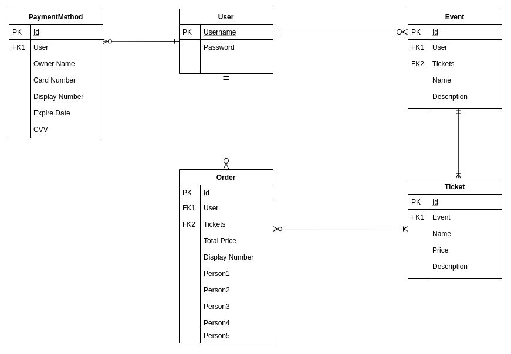
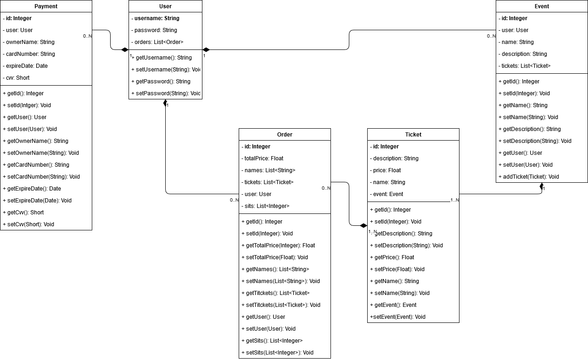

# Tic Tak Ticket

## Fase 1 ##

### Descripción general ###

Se desarrollará una web de venta de ticket, en la que el usuario podrá observar las ofertas disponibles y loguearse para adquirir entradas.
La aplicación te permitirá observar los diferentes eventos, horarios, precios de forma pública, sin necesidad de ningún tipo de elemento o método identificador. Una vez el usuario inicie sesión, tendrá acceso a los elementos de adquisición de entradas y a la publicación de eventos nuevos.

### Entidades principales ###

- **Usuarios**: Tendrán su propio nombre de usuario, único para cada uno, a parte de otros datos personales a rellenar del mismo. Podrán obtener de 0 a N compras de diferentes eventos, también poseer de 0 a N eventos a su nombre de usuario.

- **Eventos**: Tendrán un identificador único, de forma génerica poseeran una localización, un horario y uno o varios precios de entradas a generar. Será necesario que un usuario tenga la autoría del propio evento. Podrán poseer de 1 a N tipos de entradas

- **Entradas**: Las entradas serán entidades que se crearán para cada evento, tendrán un identificador único y serán asociadas a un evento. Habrá tantas entradas como diferentes entradas tenga el mismo evento, ya que se aosciarán a un usuario mediante una compra.

- **Compra**: En esta entidad se asociará la compra de una entrada mediante un usuario, dejando así reflejado la posesión de la misma del usuario para recuperarlo más fácilmente y el coste final de la misma compra.

### Descripción servicio interno ###

Cuando el usuario adquiera una entrada, se enviará a este un correo con el pdf de su entrada adjunto. El usuario podrá recuperar sus entradas cuando necesite desde su perfil en la propia aplicación.

### Equipo de desarrollo ###

- **Carlos Ruiz Romero**:
  - Correo: c.ruizr.2016@alumnos.urjc.es
  - Cuenta GitHub: [carlos8888](https://github.com/carlos8888)
  
- **David Fontela Moñino**:
  - Correo: d.fontela.2016@alumnos.urjc.es
  - Cuenta GitHub: [SrEstroncio38](https://github.com/SrEstroncio38)
    
## Fase 2 ##

### Diseño de la página ###

#### Registarse (Pública) ####

Desde esta página uno podrá registarse para poder iniciar sesión en futuras conexiones. De momento no tiene la funcionalidad implementada.

#### Iniciar sesión (Pública) ####

Permite iniciar sesión para acceder a las funcionalidades privadas. De momento no tiene la funcionalidad implementada.

### Diagrama de navegación ###

Texto

### Modelo de datos ###

A continuación se muestra como se ha implementado la relación entre las entidades principales y que métodos/atributos incorpora cada una de ellas.

- **Modelo E/R** 

- **UML**

