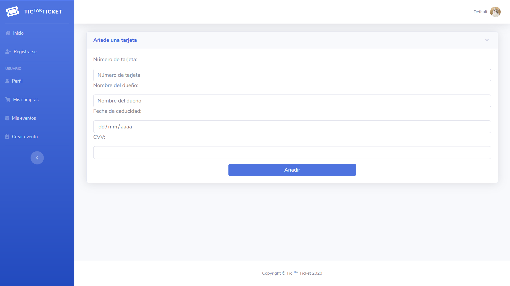
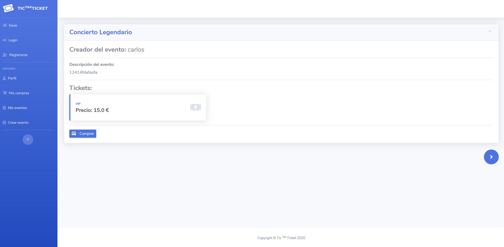
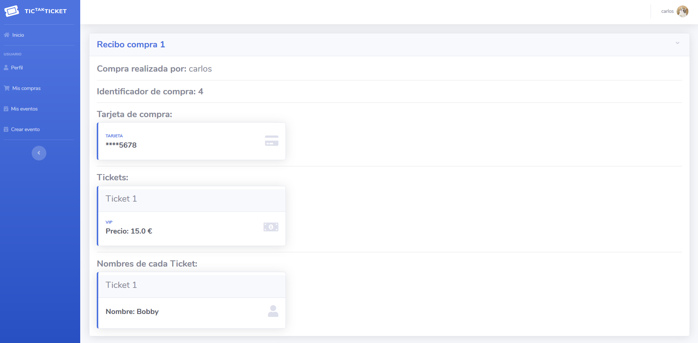
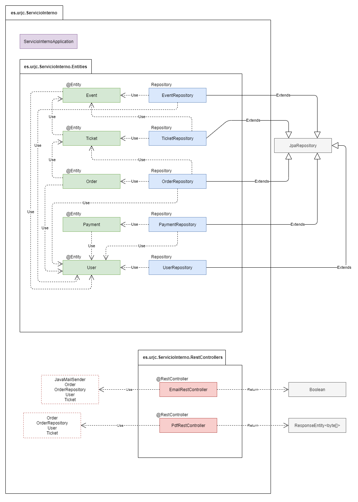

# Tic Tak Ticket

[](https://www.youtube.com/watch?v=YHOTS076vfQ&lc=UgxIO198EDdoG3AJ14J4AaABAg)

## Índice ##
1. [Fase 1](#id1) 
2. [Fase 2](#id2) 
3. [Fase 3](#id3)
4. [Fase 4](#id4)

___

## Video Fase 4 ##

[Aqui va el video]

___

## Fase 1 <a name="id1"></a> ##

### Descripción general ###

Se desarrollará una web de venta de ticket, en la que el usuario podrá observar las ofertas disponibles y loguearse para adquirir entradas.
La aplicación te permitirá observar los diferentes eventos, horarios, precios de forma pública, sin necesidad de ningún tipo de elemento o método identificador. Una vez el usuario inicie sesión, tendrá acceso a los elementos de adquisición de entradas y a la publicación de eventos nuevos.

### Entidades principales ###

- **Usuarios**: Tendrán su propio nombre de usuario, único para cada uno, a parte de otros datos personales a rellenar del mismo. Podrán obtener de 0 a N compras de diferentes eventos, también poseer de 0 a N eventos a su nombre de usuario.

- **Eventos**: Tendrán un identificador único, de forma génerica poseeran una localización, un horario y uno o varios precios de entradas a generar. Será necesario que un usuario tenga la autoría del propio evento. Podrán poseer de 1 a N tipos de entradas

- **Entradas**: Las entradas serán entidades que se crearán para cada evento, tendrán un identificador único y serán asociadas a un evento. Habrá tantas entradas como diferentes entradas tenga el mismo evento, ya que se aosciarán a un usuario mediante una compra.

- **Compra**: En esta entidad se asociará la compra de una entrada mediante un usuario, dejando así reflejado la posesión de la misma del usuario para recuperarlo más fácilmente y el coste final de la misma compra.

### Descripción servicio interno ###

Cuando el usuario adquiera una entrada, se enviará a este un correo con el pdf de su entrada adjunto. El usuario podrá recuperar sus entradas cuando necesite desde su perfil en la propia aplicación.

### Equipo de desarrollo ###

- **Carlos Ruiz Romero**:
  - Correo: c.ruizr.2016@alumnos.urjc.es
  - Cuenta GitHub: [carlos8888](https://github.com/carlos8888)
  
- **David Fontela Moñino**:
  - Correo: d.fontela.2016@alumnos.urjc.es
  - Cuenta GitHub: [SrEstroncio38](https://github.com/SrEstroncio38)


___
    
## Fase 2 <a name="id2"></a> ##

### Diseño de la página ###

#### Registarse (Pública) ####


Desde esta página uno podrá registarse para poder iniciar sesión en futuras conexiones. De momento no tiene la funcionalidad implementada.

#### Iniciar sesión (Pública) ####


Permite iniciar sesión para acceder a las funcionalidades privadas. De momento no tiene la funcionalidad implementada.

#### Inicio (Pública) ####


Desde esta página se podrán consultar los eventos disponibles junto con su información. En el supuesto de que el usuario haya iniciado sesión, podrá también adquirir las entradas.

#### Adquirir tickets (Privada) ####


El usuario podrá elegir una tarjeta de pago, un máximo de 5 tickets para adquirir y los nombres de los usuarios de los tickets. Completar la adquisición genera un valor nuevo de "Order".

#### Perfil (Privada) ####


Consulta las tarjetas de crédito asociadas a un usuario. Se pueden añadir o borrar tarjetas a elección de este.

#### Añadir tarjeta (Privada) ####


Accesible desde el perfil de usuario. Crea entradas nuevas de "Payment". Es necesario tener como mínimo una tarjeta para adquirir entradas.

#### Mis compras (Privada) ####


Permite al usuario visualizar las entradas que ha adquirido.

#### Mis eventos (Privada) ####


Similar a la página de "Eventos". Unicamente muestra los eventos que han sido creados por el usuario. No se pueden adquirir tickets desde aquí, pero te permite añadir tickets nuevos o eliminar el evento.

#### Añadir ticket (Privada) ####


Genera un nuevo tipo de ticket para un evento preexistente.

#### Crear evento (Privada) ####


Solicita los datos necesarios para generar un nuevo evento visible para todos los usuarios. También es necesaario crear un ticket que acompañe al evento.

### Diagrama de navegación ###

A continuación se presenta el diagrama de navegación que representa al usuario moviéndose por las diferentes vistas de la web.


### Modelo de datos ###

Por último, se muestra como se ha implementado la relación entre las entidades principales y que métodos/atributos incorpora cada una de ellas.

- **Modelo E/R** 


- **UML**


___

## Fase 3 <a name="id3"></a> ##

### Navegación ###

#### Registarse (Pública) ####


Desde esta página uno podrá registarse para poder iniciar sesión en futuras conexiones.

Un registro exitoso te redirige a la pantalla de login. En caso de que el usuario ya exista o los campos de contraseña no coincidan, se recarga la página.

#### Iniciar sesión (Pública) ####


Permite iniciar sesión para acceder a las funcionalidades privadas.

Se accede a esta de forma automática si se intenta acceder a una página privada sin iniciar sesión. Si uno inicia sesión de forma exitosa, se retorna a la página previa.

#### Inicio (Pública) ####




Desde esta página se podrán consultar los eventos disponibles junto con su información. En el supuesto de que el usuario haya iniciado sesión, podrá también adquirir las entradas.

Adicionalmente (igual que ocurrirá en las siguiente páginas), los menús para iniciar sesión y registrarse serán unicamente visibles si el usuario no se ha identificado. En caso contrario, estos campos desaparecerán y se visualizará un menú de usuario en la esquina superior derecha.

#### Adquirir tickets (Privada) ####


El usuario podrá elegir una tarjeta de pago, un máximo de 5 tickets para adquirir y los nombres de los usuarios de los tickets. Completar la adquisición genera un valor nuevo de "Order".

Ahora, el usuario que realiza la compra se identifica a través del request en lugar de a través de la url.

#### Perfil (Privada) ####


Consulta las tarjetas de crédito asociadas a un usuario. Se pueden añadir o borrar tarjetas a elección de este.

El usuario se recupera del propio request, no de la url.

#### Añadir tarjeta (Privada) ####


Accesible desde el perfil de usuario. Crea entradas nuevas de "Payment". Es necesario tener como mínimo una tarjeta para adquirir entradas.

Se comprueba el usuario loggeado a la hora de añadir las tarjetas.

#### Mis compras (Privada) ####



Permite al usuario visualizar las entradas que ha adquirido.

Solo se mostrarán aquellas entradas cuyo propietario coincida con el usuario que ha iniciado sesión.

#### Mis eventos (Privada) ####


Similar a la página de "Eventos". Unicamente muestra los eventos que han sido creados por el usuario. No se pueden adquirir tickets desde aquí, pero te permite añadir tickets nuevos o eliminar el evento.

Incluso si se intenta borrar/modificar un ticket del que no se es propietario a través de la url, la llamada no será exitosa si el usuario no coincide.

#### Añadir ticket (Privada) ####


Genera un nuevo tipo de ticket para un evento preexistente.

Se comprueba tanto al acceder a la página como al hacer la petición de que el usuario sea propietario del evento.

#### Crear evento (Privada) ####


Solicita los datos necesarios para generar un nuevo evento visible para todos los usuarios. También es necesario crear un ticket que acompañe al evento.

#### Diagrama de navegación ####

Se mantiene igual al presentado en la fase 2:


### Diagrama de clases y templates ###

En cuanto a las clases presentes en el proyecto, podemos definir sus relaciones como:




### Instrucciones despligue ###

Para realizar el despligue de la aplicación, primero debemos crear una máquina virtual de Ubuntu 14.04 LTS en nuestro ordenador. Para ello seguiremos los siguientes pasos.

Instalaremos [*VirtualBox*](https://www.virtualbox.org/wiki/Downloads) y [*Vagrant*](https://www.vagrantup.com/downloads.html).

Cuando hayamos instalado ambos programas y reiniciado el PC, procederemos a crear la máquina virtual desde la consola de nuestro SO con los siguientes comandos:

```
mkdir -p ~/vagrant/spring
cd ~/vagrant/spring
vagrant init ubuntu/trusty32
```

Iremos al la ruta `~/vagrant/spring` y modificaremos el archivo *Vagrantfile* y descomentaremos la siguiente linea:

`# config.vm.network "private_network", ip: "192.168.33.10”`

Tras descomentar la línea podemos encender nuestra máquina virtual comprobando así que todo funcione correctamente y conectarnos a ella:

```
vagrant up
ping 192.168.33.10
vagrant ssh
```

Para el correcto despligue de las aplicaciones será necesario la instalación previa dentro de la Máquina Virtual de: 

- **JRE de Java**

- **MYSQL**

Primeramente nos aseguramos de tener asegurados la JRE de Java con el siguiente comando:

`java -version`

Si no se encuentra la orden de Java significa que no la tenemos instalada la JRE y tendremos que usar los siguientes comandos:

```
sudo add-apt-repository ppa:openjdk-r/ppa
sudo apt-get update
sudo apt-get install openjdk-8-jdk
```

A continuación comprobamos que tengamos instalado MySQL en nuestra máquina con el siguiente comando:

`mysql --version`

Si no se encuentra la orden de MySQL significa que no tenemos instalado MySQL por lo que tendremos que hacerlo con el siguiente comando:

`sudo apt install mysql-server`

Tras la instalación comprobamos que MySQL tiene como usuario administrador **root** y sin contraseña, para ello usaremos los siguientes comandos:

```
sudo mysql
mysql> SELECT user,authentication_string,plugin,host FROM mysql.user;
```

Nos debería salir un Output similiar al siguiente, el cual si coincide la primera fila faltaría hacer un paso extra.

```
+------------------+-------------------------------------------+-----------------------+-----------+
| user             | authentication_string                     | plugin                | host      |
+------------------+-------------------------------------------+-----------------------+-----------+
| root             |                                           | auth_socket           | localhost |
| mysql.session    | *THISISNOTAVALIDPASSWORDTHATCANBEUSEDHERE | mysql_native_password | localhost |
| mysql.sys        | *THISISNOTAVALIDPASSWORDTHATCANBEUSEDHERE | mysql_native_password | localhost |
| debian-sys-maint | *CC744277A401A7D25BE1CA89AFF17BF607F876FF | mysql_native_password | localhost |
+------------------+-------------------------------------------+-----------------------+-----------+
4 rows in set (0.00 sec)
```

El paso extra es en referencia a la columna plugin, para que funcione nuestra aplicación es necesario cambiar el método de *auth_socket* a *mysql_native_password*. Para ello hay varias formas posibles, la primera y más sencilla es usar los siguientes comandos:


```
sudo mysql
mysql> ALTER USER 'root'@'localhost' IDENTIFIED WITH mysql_native_password BY 'password';
mysql> FLUSH PRIVILEGES;
```

Es posible que este proceso de un error, si es así podemos usar la siguiente opción:

```
sudo mysql
mysql> use mysql;
mysql> update user set plugin='mysql_native_password' where User='root';
mysql> FLUSH PRIVILEGES;
```

Sabiendo ya que nuestro usuario de administrador es el correcto debemos crear el esquema de la BBDD que coincida con el de nuestra aplicación, nuestro caso se llama **tic_tak_ticket**, para ello ejecutaremos los siguientes comandos:

```
sudo mysql
mysql> CREATE SCHEMA tic_tak_ticket;
```

Tras esto dejamos activo el servidor de MySQL, en principio tras la instalación se activa automáticamente, para comprobarlo se puede utilizar el siguiente comando, el cual no explicará el estado del servicio MySQL.

`sudo service mysql status`

Si no estuviera activo, lo podemos activar con este comando:

`sudo service mysql start`

Por último es necesario actualizar unos certificados para que la máquina sea capaz de mandar emails a los usuarios, esto se hará ejecutando los siguientes comandos:

```
sudo apt-get install -y ca-certificates-java
sudo mkdir /etc/ssl/certs/java/
sudo update-ca-certificates -f
```

Teniendo ya preparada la base de datos solo queda ejecutar ambas aplicaciones. Para ello realizamos podremos tanto realizar un clone del repositorio en nuestra máquina o simplemente copiar los archivos localmente.
 

La opción más sencilla es copiar los archivos localmente. Para ello solo habría que colocar ambos *.jar* en la siguiente ruta (En Windows ~ significa la carpeta del Usuario que está ejecutando Windows):

`~/vagrant/Spring`

Tras copiarlos será necesario abrir dos consolas de Windows donde ejecutaremos los siguientes comandos:

1º consola
```
cd ~/vagrant/spring
vagrant ssh
sudo java -jar vagrant/Tic-Tak-Ticket-0.0.1-SNAPSHOT.jar
```

2º consola
```
cd ~/vagrant/spring
vagrant ssh
sudo java -jar vagrant/ServicioInterno-0.0.1-SNAPSHOT.jar
```

Si se deseara realizar el clone, es necesario tener instalado **git** en nuestra máquina. Si no lo tenemos instalado usaremos el siguiente comando:

`sudo apt install git`

Si ya lo tenemos instalado podemos clonar el repositorio abriendo una consola en la carpeta donde queramos clonar la aplicación y ejecutando lo siguiente:

```
cd /vagrant
git clone https://github.com/SrEstroncio38/PracticaDaD.git
```

Al ejecutar este comando se nos copiará la carpeta del proyecto en nuestro directorio */vagrant* de nuestra máquina, por lo que para poder ejecutar ambas aplicaciones tendremos que utilizar dos consolas de Windows por separado en las que ejecutaremos los siguientes comandos:

1º consola
```
cd ~/vagrant/spring
vagrant ssh
sudo java -jar vagrant/PracticaDaD/Ejecutables/Tic-Tak-Ticket-0.0.1-SNAPSHOT.jar
```

2º consola
```
cd ~/vagrant/spring
vagrant ssh
sudo java -jar vagrant/PracticaDaD/Ejecutables/ServicioInterno-0.0.1-SNAPSHOT.jar
```

____
## Fase 4 <a name="id4"></a> ##

### Ejemplo de ejecución ###

A continuación, presentamos un video donde se puede visualizar el funcionamiento de la aplicación.

[](https://www.youtube.com/watch?v=YHOTS076vfQ&lc=UgxIO198EDdoG3AJ14J4AaABAg)

Este video es el mismo que se presenta al principio del Readme.

### Diagrama de clases y templates ###

Se mantiene igual a los presentados en la fase 3:


### Diagrama de infraestructura en Docker ###

El siguiente diagrama corresponde a la infraestructura que se ha generado mediante _Docker_ para nuestra aplicación.


### Instrucciones despliegue ###

Finalmente, ejecutar está fase en su ordenador es tan sencillo como tener instalado tanto _Docker_ como _Docker-compose_ en su máquina, entrar en la carpeta _~/dockers_ del repositorio, o colocarla en el lugar donde se desee del pc, y ejecutar el siguiente comando:

`sudo docker-compose up --build`

Tras esto esperamos a que termine de desplegarse y ya podríamos acceder la aplicación en la ip _127.0.0.1:443_.

En el caso de que se quiera detener alguno de los procesos activos en el docker se puede hacer (desde otra consola) a través del comando:

`sudo docker stop <id>`

La id se puede consultar usando:

`sudo docker ps`