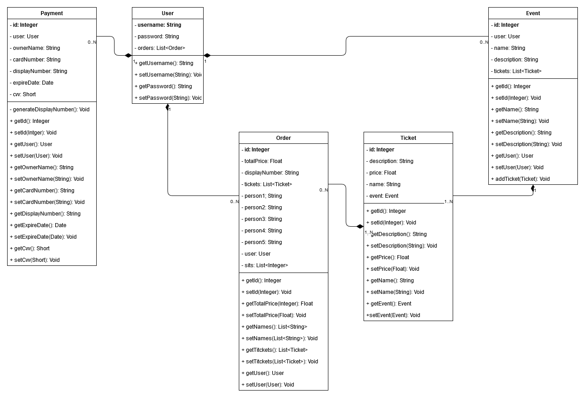

# Tic Tak Ticket

## Fase 1 ##

### Descripción general ###

Se desarrollará una web de venta de ticket, en la que el usuario podrá observar las ofertas disponibles y loguearse para adquirir entradas.
La aplicación te permitirá observar los diferentes eventos, horarios, precios de forma pública, sin necesidad de ningún tipo de elemento o método identificador. Una vez el usuario inicie sesión, tendrá acceso a los elementos de adquisición de entradas y a la publicación de eventos nuevos.

### Entidades principales ###

- **Usuarios**: Tendrán su propio nombre de usuario, único para cada uno, a parte de otros datos personales a rellenar del mismo. Podrán obtener de 0 a N compras de diferentes eventos, también poseer de 0 a N eventos a su nombre de usuario.

- **Eventos**: Tendrán un identificador único, de forma génerica poseeran una localización, un horario y uno o varios precios de entradas a generar. Será necesario que un usuario tenga la autoría del propio evento. Podrán poseer de 1 a N tipos de entradas

- **Entradas**: Las entradas serán entidades que se crearán para cada evento, tendrán un identificador único y serán asociadas a un evento. Habrá tantas entradas como diferentes entradas tenga el mismo evento, ya que se aosciarán a un usuario mediante una compra.

- **Compra**: En esta entidad se asociará la compra de una entrada mediante un usuario, dejando así reflejado la posesión de la misma del usuario para recuperarlo más fácilmente y el coste final de la misma compra.

### Descripción servicio interno ###

Cuando el usuario adquiera una entrada, se enviará a este un correo con el pdf de su entrada adjunto. El usuario podrá recuperar sus entradas cuando necesite desde su perfil en la propia aplicación.

### Equipo de desarrollo ###

- **Carlos Ruiz Romero**:
  - Correo: c.ruizr.2016@alumnos.urjc.es
  - Cuenta GitHub: [carlos8888](https://github.com/carlos8888)
  
- **David Fontela Moñino**:
  - Correo: d.fontela.2016@alumnos.urjc.es
  - Cuenta GitHub: [SrEstroncio38](https://github.com/SrEstroncio38)
    
## Fase 2 ##

### Diseño de la página ###

#### Registarse (Pública) ####

Desde esta página uno podrá registarse para poder iniciar sesión en futuras conexiones. De momento no tiene la funcionalidad implementada.

#### Iniciar sesión (Pública) ####

Permite iniciar sesión para acceder a las funcionalidades privadas. De momento no tiene la funcionalidad implementada.

#### Inicio (Pública) ####

Desde esta página se podrán consultar los eventos disponibles junto con su información. En el supuesto de que el usuario haya iniciado sesión, podrá también adquirir las entradas.

#### Adquirir tickets (Privada) ####

El usuario podrá elegir una tarjeta de pago, un máximo de 5 tickets para adquirir y los nombres de los usuarios de los tickets. Completar la adquisición genera un valor nuevo de "Order".

#### Perfil (Privada) ####

Consulta las tarjetas de crédito asociadas a un usuario. Se pueden añadir o borrar tarjetas a elección de este.

#### Añadir tarjeta (Privada) ####

Accesible desde el perfil de usuario. Crea entradas nuevas de "Payment". Es necesario tener como mínimo una tarjeta para adquirir entradas.

#### Mis compras (Privada) ####

Permite al usuario visualizar las entradas que ha adquirido.

#### Mis eventos (Privada) ####

Similar a la página de "Eventos". Unicamente muestra los eventos que han sido creados por el usuario. No se pueden adquirir tickets desde aquí, pero te permite añadir tickets nuevos o eliminar el evento.

#### Añadir ticket (Privada) ####

Genera un nuevo tipo de ticket para un evento preexistente.

#### Crear evento (Privada) ####

Solicita los datos necesarios para generar un nuevo evento visible para todos los usuarios. También es necesaario crear un ticket que acompañe al evento.

### Diagrama de navegación ###

A continuación se presenta el diagrama de navegación que representa al usuario moviéndose por las diferentes vistas de la web.

### Modelo de datos ###

Por último, se muestra como se ha implementado la relación entre las entidades principales y que métodos/atributos incorpora cada una de ellas.

- **Modelo E/R** 

- **UML**

## Fase 3 ##

### Navegación ###

#### Registarse (Pública) ####

Desde esta página uno podrá registarse para poder iniciar sesión en futuras conexiones.

Un registro exitoso te redirige a la pantalla de login. En caso de que el usuario ya exista o los campos de contraseña no coincidan, se recarga la página.

#### Iniciar sesión (Pública) ####

Permite iniciar sesión para acceder a las funcionalidades privadas.

Se accede a esta de forma automática si se intenta acceder a una página privada sin iniciar sesión. Si uno inicia sesión de forma exitosa, se retorna a la página previa.

#### Inicio (Pública) ####

Desde esta página se podrán consultar los eventos disponibles junto con su información. En el supuesto de que el usuario haya iniciado sesión, podrá también adquirir las entradas.

Adicionalmente (igual que ocurrirá en las siguiente páginas), los menús para iniciar sesión y registrarse serán unicamente visibles si el usuario no se ha identificado. En caso contrario, estos campos desaparecerán y se visualizará un menú de usuario en la esquina superior derecha.

#### Adquirir tickets (Privada) ####

El usuario podrá elegir una tarjeta de pago, un máximo de 5 tickets para adquirir y los nombres de los usuarios de los tickets. Completar la adquisición genera un valor nuevo de "Order".

Ahora, el usuario que realiza la compra se identifica a través del request en lugar de a través de la url.

#### Perfil (Privada) ####

Consulta las tarjetas de crédito asociadas a un usuario. Se pueden añadir o borrar tarjetas a elección de este.

El usuario se recupera del propio request, no de la url.

#### Añadir tarjeta (Privada) ####

Accesible desde el perfil de usuario. Crea entradas nuevas de "Payment". Es necesario tener como mínimo una tarjeta para adquirir entradas.

Se comprueba el usuario loggeado a la hora de añadir las tarjetas.

#### Mis compras (Privada) ####

Permite al usuario visualizar las entradas que ha adquirido.

Solo se mostrarán aquellas entradas cuyo propietario coincida con el usuario que ha iniciado sesión.

#### Mis eventos (Privada) ####

Similar a la página de "Eventos". Unicamente muestra los eventos que han sido creados por el usuario. No se pueden adquirir tickets desde aquí, pero te permite añadir tickets nuevos o eliminar el evento.

Incluso si se intenta borrar/modificar un ticket del que no se es propietario a través de la url, la llamada no será exitosa si el usuario no coincide.

#### Añadir ticket (Privada) ####

Genera un nuevo tipo de ticket para un evento preexistente.

Se comprueba tanto al acceder a la página como al hacer la petición de que el usuario sea propietario del evento.

#### Crear evento (Privada) ####

Solicita los datos necesarios para generar un nuevo evento visible para todos los usuarios. También es necesario crear un ticket que acompañe al evento.

#### Diagrama de navegación ####

Aunque este permanece bastante similar al presentado en la fase 2, si que se notan algunas diferencias:

IMAGEN

### Diagrama de clases y templates ###

En cuanto a las clases presentes en el proyecto, podemos definir sus relaciones como:

